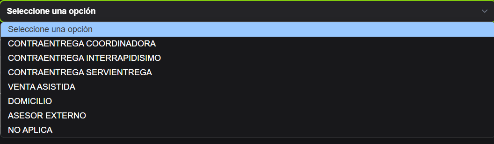
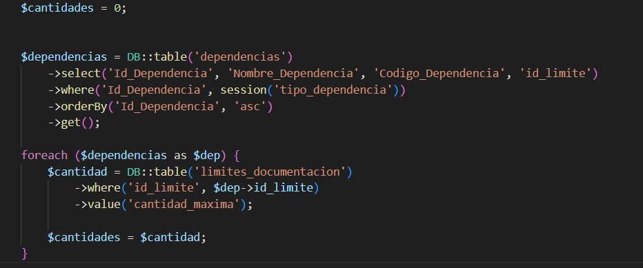

# <CONDICIONAL DE DOCUMENTACION>

# DESCRIPCION DEL PROBLEMA
  Actualmente las personas subian la documentacion con una condicional de dos documentos pendientes por usuario, esto dificulto 
  la escalabilidad ya que havian varios usuarios que tenian diferentes tipos de ventas y que requerian subir la documentacion depues de determinado tiempo pero que asu vez el aplicativo les permitiera seguir la gestion del proceso.

# DESCRIPCION DRE LA SOLUCION
  Se agrego un nuevo select en el apartado principal () en el select dependencias donde tiene las opciones de contraentrega que esta opcion no tiene limites de documentacion, para asesor externo se limita la cantidad de documentos no subidos a 5 pero si seleccionan no aplica que seria igual a seleccionar tienda fisica tendria un limite de 2 documentos. (lista del select )

# CONCLUSIONES
  Primero se hacen las respectivas consultas a la base de datos en la tabla detalles_cliente en la colubna Id_Dependencia, esta colubna tiene una llave foranea a la table dependencias () que dependencias tiene un nombre de la dependencia que son los mismos que se usan en el select de () y tambien un id de limite establecido para cada opcion ese id_limite tiene una llave foranea a la tabla limites_documentacion ().

  La informacion es consultada por el id del cliente se guarda el resultado en la variable ($dependencias) dinde es iterada por un for para validar cada cantidad () y posterior mente ser validado en el condicional () donde valida que la cantidad sea != de 0 siendo 0 la cantidad ilimitada, pero si es diferente de 0 validaria la cantidad de la cocumentacion haciendo la consulta asignando en el limite la cantidad de documentos permitidos. ()

  flowchart TD
    A[Usuario] --> B[Selecciona Dependencia en el select]
    B --> C[Resolver límite desde dependencias → limites_documentacion]
    C --> D[Calcular documentos pendientes del cliente]
    D --> E{¿Límite = 0?}
    E -- Sí --> G[Permitir continuar (ilimitado)]
    E -- No --> F{¿Pendientes < Límite?}
    F -- Sí --> G[Permitir continuar]
    F -- No --> H[Bloquear / Mostrar aviso]
